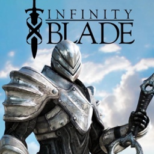

 
infinityblade3_nx

Infinity Blade III on Nintendo Switch

An unofficial Nintendo Switch wrapper for the Android version of Infinity Blade.

About

infinityblade3_nx is a Nintendo Switch wrapper for libib3.so from the Android Infinity Blade III port. It provides the Android, Bionic, audio, input, and graphics services required by the runtime under Horizon OS.

The runtime uses the original iOS version of Infinity Blade III from a user-supplied IPA. Both the Android APK and IPA are required.

Status: Working on Nintendo Switch. A minor visual bug does occur, but the game remains fully playable.

The repository does not include the game, APK, IPA, libraries, or assets. You must provide your own legally obtained copies.

Controls

Controller inputs are translated into the taps and swipes used by the original mobile interface. The touchscreen remains available in handheld mode.

Input	Normal mode	Cursor mode
Touchscreen	Native touch controls	Native touch controls
Left Stick	Short combat swipe	Move the cursor
Right Stick	Short camera swipe	Shorter camera swipe
D-Pad	Directional swipe	Directional swipe
A	Tap the centre	Click at the cursor
B	Hold shield	Hold the bottom-right control
Y / X	Sword / magic	Sword / magic
ZL / ZR	Dodge left / right	Click at the cursor
+ / –	Pause / unpause	Pause / unpause
L	—	Recenter the cursor
R	Enable cursor mode	Return to normal mode

Each stick or D-Pad flick sends one swipe and must return to centre before another swipe is sent. Hold-style mappings remain pressed until the physical button is released.

Build
Requirements

devkitPro

devkitA64 and libnx

Switch Mesa and libdrm_nouveau

Switch SDL2, mpg123, zlib and libpng

GNU Make

Install the required devkitPro packages:

pacman -S switch-dev switch-mesa switch-libdrm_nouveau switch-sdl2 switch-mpg123 switch-zlib switch-libpng

Compile the wrapper:

cd infinityblade_nx
make -j

For a clean rebuild:

make clean
make -j

Running

Prepare the runtime directory on a PC using your own APK and IPA:

python3 tools/prepare_runtime.py InfinityBladeIII-Android-1_2_1.apk \
    --ipa "Infinity Blade III.ipa" \
    --output runtime \
    --nro infinityblade3_nx.nro

Copy the result to the SD card:

sd:/switch/infinityblade3_nx/
├── infinityblade3_nx.nro
├── cursor.png
├── libib3.so
├── game/Payload/SwordGame.app/...
└── SaveData/

The game needs roughly 3 GB on the SD card. Launch the NRO through title override for full application memory: hold R while opening an installed game, then start Infinity Blade III from the Homebrew Menu.

Status

Working on Nintendo Switch. A minor visual bug does occur, but the game remains fully playable.

Credits

Infinity Blade III Nintendo Switch port — her_kirby

Original Infinity Blade Nintendo Switch wrapper — aks796

Infinity Blade Android port — InfinityBladeGuy

The loader and compatibility layer derive from the open-source Switch .so loader work by Andy Nguyen, fgsfds, and ChanseyIsTheBest, building on TheOfficialFloW's Vita and Switch loader work. The inherited wrapper code is MIT-licensed.

Infinity Blade was developed by Chair Entertainment and Epic Games and published by Epic Games.

Contributing

Bug reports and tested improvements are welcome. Include the build version, steps to reproduce, and the relevant infinityblade_nx.log when reporting an issue.

Disclaimer

This is an unofficial fan project and is not affiliated with, sponsored by, or endorsed by Chair Entertainment or Epic Games. Infinity Blade and all related artwork, audio, trademarks, and game assets belong to their respective owners.

This repository contains only the compatibility code required by the Nintendo Switch port and does not distribute proprietary game files. Users must provide their own legally obtained copies.
